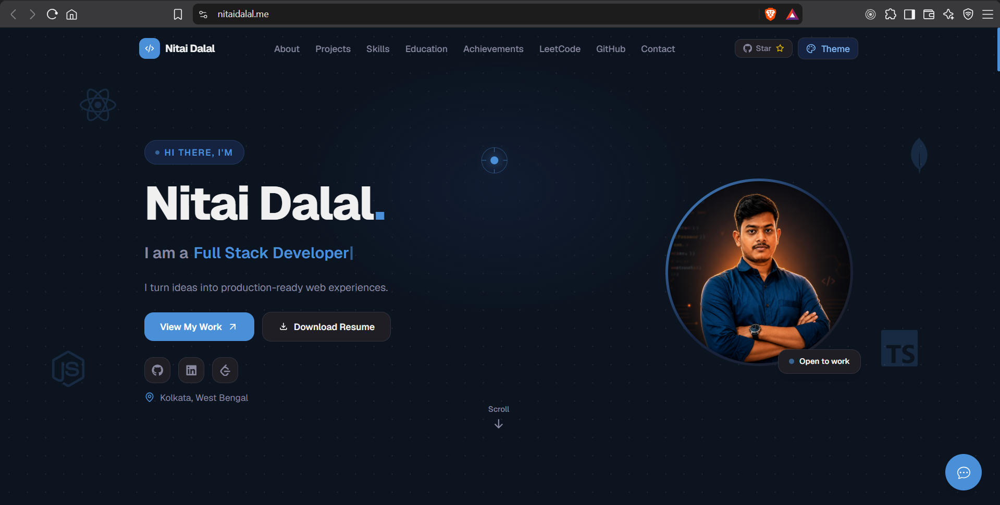
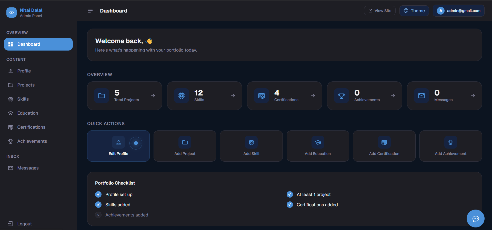
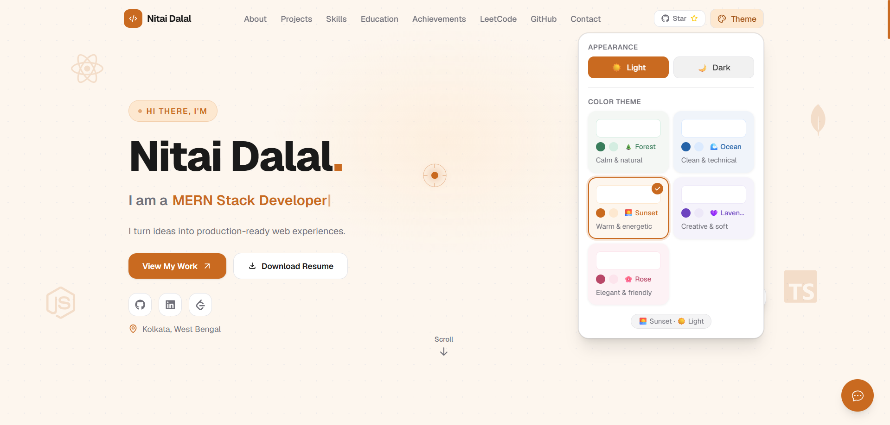
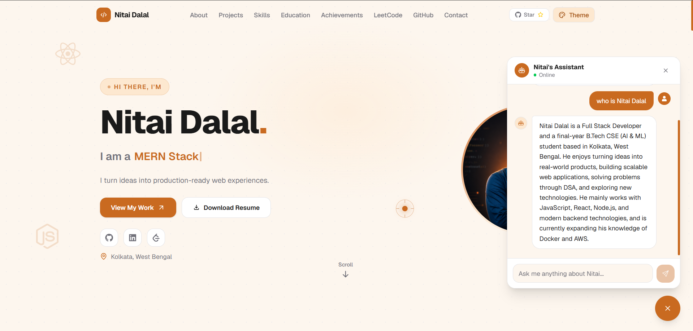
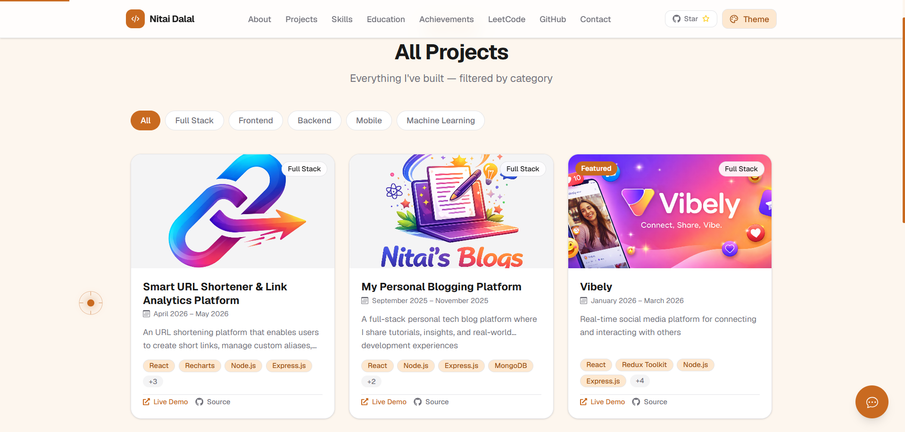
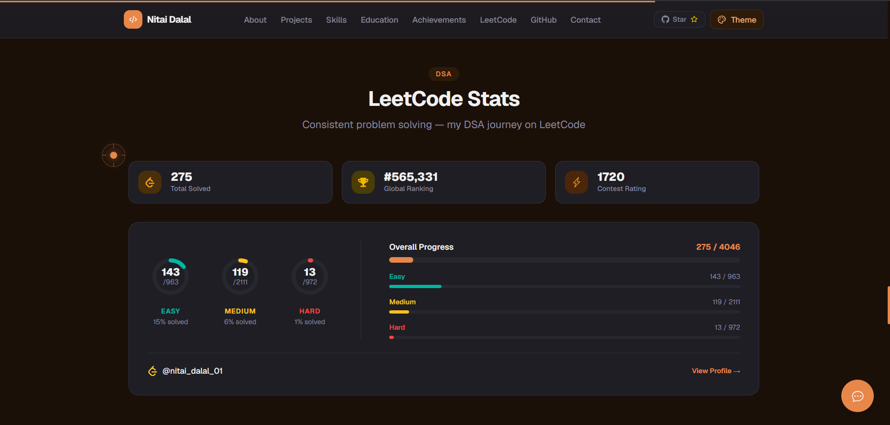
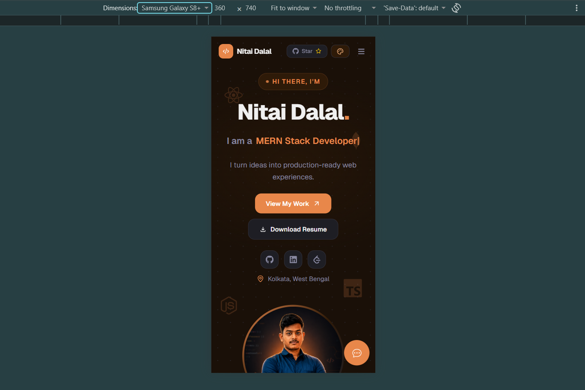

<div align="center">

# 🚀 Nitai Dalal — Developer Portfolio

### A full-stack dynamic developer portfolio with AI assistant, admin CMS, and 10-combination theme system

[](https://nitaidalal.me)
[](https://nitaidalal-portfolio.onrender.com/)
</div>

---

## 📸 Screenshots

> **Hero Section**
> 

> **Admin Dashboard**
> 

> **Theme Switcher**
> 

> **AI Chatbot**
> 

> **Projects Section**
> 

> **LeetCode Stats**
> 

> **Mobile View**
> 

---

## 🌐 Live Links

| Service | URL |
|---------|-----|
| 🌍 Portfolio | [nitaidalal.me](https://nitaidalal.me) |
| ⚙️ Backend API | [nitaidalal-portfolio.onrender.com](https://nitaidalal-portfolio.onrender.com/api/health) |

---

## ✨ Features

### 🌍 Public Portfolio
- **Dynamic Hero** — Typewriter taglines, avatar, social links, visitor counter, Hire Me button
- **About Me** — Bio, featured tech stack with Devicons, stat cards (currently building/learning), open to opportunities badge
- **Projects** — Featured grid on home + full projects page with category filtering
- **Project Detail Page** — Full description, tech stack with icons, live/repo links, related projects
- **Skills** — Grouped by category (Languages, Frameworks, Databases, Tools, DevOps) with animated proficiency bars
- **Education** — College and School aware cards (CGPA, percentage, board, passing year)
- **Certifications** — Badge images, issuer, date, verification links
- **Achievements** — Category-based cards with proof links and animated reveals
- **LeetCode Stats** — Live Easy/Medium/Hard breakdown with animated SVG rings and progress bars
- **GitHub Activity** — Contribution calendar, stats cards, streak stats — all theme-aware
- **AI Chatbot** — Real-time streaming chatbot (Gemini) that answers anything about the portfolio
- **Contact Form** — With auto-reply email to visitor and notification email to admin
- **Responsive** — Fully mobile-first, tested across all breakpoints

### 🔐 Admin CMS (Protected)
- **Secure Login** — JWT authentication with httpOnly cookie, brute force rate limiting
- **Dashboard** — Portfolio checklist, stats overview, unread message alerts, quick actions
- **Manage Profile** — Edit bio, taglines, hero subtitle, social links, SEO meta — upload avatar and resume
- **Manage Projects** — Full CRUD with image upload, publish/draft toggle, featured toggle, category
- **Manage Skills** — Devicon slug preview, proficiency percentage slider, featured toggle for About section
- **Manage Education** — School/College aware form with conditional fields
- **Manage Certifications** — Badge image upload, verification URL, issue date
- **Manage Achievements** — Category, proof link, image upload
- **Manage Messages** — Read/unread inbox, expand messages, reply directly from dashboard (sends email to visitor), delete
- **Change Password** — Secure password update flow
- **Theme Switcher** — Available in both navbar and admin panel

### 🎨 Theme System
- **5 Color Themes** — Forest 🌲, Ocean 🌊, Sunset 🌅, Lavender 💜, Rose 🌸
- **Light + Dark** — Each theme has both light and dark variant = **10 combinations**
- **CSS Variables** — `data-theme` on `<html>` root, shadcn/ui compatible tokens
- **localStorage Persistence** — Theme choice saved across sessions
- **Live Preview** — Popover with visual mini-previews of each theme

### ⚡ Technical Highlights
- **Streaming AI** — Server-Sent Events (SSE) for word-by-word Gemini response streaming
- **Server-side Caching** — LeetCode and GitHub APIs cached for 10–15 minutes to prevent rate limits
- **Email Templates** — Three production-grade HTML email templates (auto-reply, admin notification, admin reply)
- **Keep-alive Cron** — Pings Render every 14 minutes to prevent cold starts


---

## 🛠️ Tech Stack

### Frontend
| Technology | Purpose |
|------------|---------|
| React 19 + Vite 7 | UI framework and build tool |
| Tailwind CSS v4 | Utility-first styling |
| shadcn/ui + Radix UI | Accessible UI primitives |
| Framer Motion | Animations and transitions |
| React Router v7 | Client-side routing |
| Axios | HTTP client with interceptors |
| react-icons | Icon library |
| react-github-calendar | GitHub contribution graph |
| sonner | Toast notifications |
| react-helmet-async | SEO meta tags |

### Backend
| Technology | Purpose |
|------------|---------|
| Node.js + Express | REST API server |
| MongoDB + Mongoose | Database and ODM |
| JWT + bcryptjs | Authentication and password hashing |
| Cloudinary | Image and PDF cloud storage |
| Multer | File upload handling |
| Zod | Request validation |
| Nodemailer / Resend | Email delivery |
| @google/genai
| node-cron | Keep-alive scheduler |
| express-rate-limit | Rate limiting |
| helmet + morgan | Security headers and logging |
| express-mongo-sanitize | MongoDB injection prevention |

### Infrastructure
| Service | Purpose |
|---------|---------|
| Vercel | Frontend hosting |
| Render | Backend hosting |
| MongoDB Atlas | Cloud database |
| Cloudinary | Media storage |
| Resend | Transactional email |
| Google AI Studio | Gemini API |

---

## 📁 Project Structure

```
portfolio/
├── client/                          # React frontend (Vite)
│   ├── src/
│   │   ├── components/
│   │   │   ├── admin/               # Admin layout + forms + tables
│   │   │   ├── cards/               # ProjectCard, SkillCard, etc.
│   │   │   ├── chat/                # AI ChatWidget
│   │   │   ├── layout/              # Navbar, Footer, PageWrapper
│   │   │   ├── sections/            # Hero, About, Skills, etc.
│   │   │   ├── shared/              # LoadingSpinner, ErrorMessage, etc.
│   │   │   ├── theme/               # ThemeSwitcher, ThemePreview
│   │   │   └── ui/                  # shadcn/ui components
│   │   ├── config/                  # axios instance, theme config
│   │   ├── context/                 # ThemeContext, AuthContext
│   │   ├── hooks/                   # useTheme, useAuth, useScrollTop
│   │   ├── pages/
│   │   │   ├── admin/               # Dashboard, ManageProjects, etc.
│   │   │   └── public/              # Home, AllProjects, ProjectDetail
│   │   ├── services/                # API service layer
│   │   └── utils/                   # formatDate, constants
│
└── server/                          # Node.js + Express backend
    ├── config/                      # db.js, cloudinary.js
    ├── controllers/                 # Business logic
    ├── middleware/                  # auth, upload, error, rateLimiter
    ├── models/                      # Mongoose schemas
    ├── routes/                      # Route definitions
    ├── utils/                       # apiResponse, sendEmail, emailTemplates, buildSystemPrompt, keepAlive
    ├── validators/                  # Zod schemas
    └── seed.js                      # Admin + Profile seed script
```

---

## 🚀 Getting Started

### Prerequisites
- Node.js v18+
- MongoDB Atlas account
- Cloudinary account
- Resend account
- Google AI Studio API key (Gemini)

### 1. Clone the repository

```bash
git clone https://github.com/nitaidalal/nitaidalal-portfolio.git
cd nitaidalal-portfolio
```

### 2. Setup Backend

```bash
cd server
npm install
cp .env.example .env
# fill in your .env values
npm run seed     # creates admin account + default profile
npm run dev      # starts on http://localhost:5000
```

### 3. Setup Frontend

```bash
cd client
npm install
cp .env.example .env
# fill in your .env values
npm run dev      # starts on http://localhost:5173
```

---

## 🔐 Environment Variables

### Backend — `server/.env`

```bash
# ─── Server ───────────────────────────────────────────
PORT=5000
NODE_ENV=development

# ─── MongoDB ──────────────────────────────────────────
MONGO_URI=mongodb+srv://<username>:<password>@cluster0.mongodb.net/portfolio

# ─── JWT ──────────────────────────────────────────────
JWT_SECRET=your_super_secret_jwt_key_minimum_32_characters
JWT_EXPIRES_IN=7d

# ─── Cloudinary ───────────────────────────────────────
CLOUDINARY_CLOUD_NAME=your_cloud_name
CLOUDINARY_API_KEY=your_api_key
CLOUDINARY_API_SECRET=your_api_secret

# ─── Resend (Email) ───────────────────────────────────
RESEND_API_KEY=re_xxxxxxxxxxxxxxxxxxxx
RESEND_FROM_EMAIL=onboarding@resend.dev

# ─── Admin Credentials (used by seed script) ──────────
ADMIN_EMAIL=admin@portfolio.com
ADMIN_PASSWORD=your_strong_password_here

# ─── Gemini AI ────────────────────────────────────────
GEMINI_API_KEY=your_gemini_api_key

# ─── Frontend URL (CORS) ──────────────────────────────
CLIENT_URL=http://localhost:5173

# ─── Social (used in email templates) ─────────────────
LINKEDIN_URL=https://linkedin.com/in/your_username
```

### Frontend — `client/.env`

```bash
# ─── API ──────────────────────────────────────────────
VITE_API_BASE_URL=http://localhost:5000/api

# ─── GitHub ───────────────────────────────────────────
VITE_GITHUB_USERNAME=your_github_username
VITE_GITHUB_REPO=your_username/your_repo_name

# ─── LeetCode ─────────────────────────────────────────
VITE_LEETCODE_USERNAME=your_leetcode_username
```

---

## 🌱 Seeding the Database

Before using the admin panel for the first time, run the seed script to create your admin account and default profile:

```bash
cd server
npm run seed
```

This creates:
- ✅ Admin account with credentials from `.env`
- ✅ Default profile document with placeholder data

> ⚠️ The seed script is safe to run multiple times — it skips if data already exists.

---

## 📡 API Reference

### Public Endpoints
| Method | Endpoint | Description |
|--------|----------|-------------|
| GET | `/api/health` | Health check |
| GET | `/api/profile` | Get portfolio profile |
| GET | `/api/projects` | Get all published projects |
| GET | `/api/projects/featured` | Get featured projects |
| GET | `/api/projects/:id` | Get single project |
| GET | `/api/skills` | Get all skills |
| GET | `/api/education` | Get all education |
| GET | `/api/certifications` | Get all certifications |
| GET | `/api/achievements` | Get all achievements |
| GET | `/api/leetcode/:username` | Get LeetCode stats |
| GET | `/api/github/:username` | Get GitHub contributions |
| POST | `/api/messages` | Submit contact form |
| POST | `/api/chat` | Chat with AI assistant |

### Admin Endpoints (Protected)
| Method | Endpoint | Description |
|--------|----------|-------------|
| POST | `/api/auth/login` | Admin login |
| POST | `/api/auth/logout` | Admin logout |
| GET | `/api/auth/me` | Get current admin |
| PUT | `/api/auth/change-password` | Change password |
| PUT | `/api/admin/profile` | Update profile |
| PUT | `/api/admin/profile/avatar` | Upload avatar |
| PUT | `/api/admin/profile/resume` | Upload resume |
| POST/PUT/DELETE | `/api/admin/projects` | Manage projects |
| POST/PUT/DELETE | `/api/admin/skills` | Manage skills |
| POST/PUT/DELETE | `/api/admin/education` | Manage education |
| POST/PUT/DELETE | `/api/admin/certifications` | Manage certifications |
| POST/PUT/DELETE | `/api/admin/achievements` | Manage achievements |
| GET | `/api/admin/messages` | Get all messages |
| POST | `/api/admin/messages/:id/reply` | Reply to message |
| PATCH | `/api/admin/messages/:id/read` | Mark as read |
| DELETE | `/api/admin/messages/:id` | Delete message |

---

## 🎨 Theme System

The portfolio supports **10 theme combinations** controlled via `data-theme` on the `<html>` element:

| Theme | Light | Dark |
|-------|-------|------|
| 🌲 Forest | `forest-light` | `forest-dark` |
| 🌊 Ocean | `ocean-light` | `ocean-dark` |
| 🌅 Sunset | `sunset-light` | `sunset-dark` |
| 💜 Lavender | `lavender-light` | `lavender-dark` |
| 🌸 Rose | `rose-light` | `rose-dark` |

All colors are defined as CSS custom properties in `src/index.css` and map directly to Tailwind utility classes like `bg-background`, `text-foreground`, `bg-primary` etc.

---

## 📧 Email System

Three automated email templates built with inline HTML:

| Trigger | Recipient | Template |
|---------|-----------|----------|
| User submits contact form | User | Auto-reply with message preview |
| User submits contact form | Admin | New message notification |
| Admin clicks Reply in dashboard | User | Personalized reply with original message |

---

## 🤖 AI Chatbot

The chatbot uses **Google Gemini 3.5 Flash Lite** with:
- **Context injection** — fetches fresh MongoDB data on every conversation
- **Chat history** — maintains conversation context within a session
- **Streaming** — word-by-word response via Server-Sent Events (SSE)
- **Rate limiting** — 30 messages per 10 minutes per IP
- **Auto-update** — adding new projects/skills automatically reflects in chatbot answers

---

## 📱 Admin Access

| Method | How |
|--------|-----|
| Desktop | Navigate to `/admin/login` or click the hidden `·` dot in the footer |
| Mobile | Long press the logo in the navbar for 1.5 seconds |

The admin panel automatically redirects to `/admin/dashboard` if already logged in.

---

## 🚢 Deployment

### Frontend (Vercel)
```bash
# Set environment variables in Vercel dashboard
# Deploy from GitHub — automatic on push to main
```

### Backend (Render)
```bash
# Set all server/.env variables in Render dashboard
# Build command: npm install
# Start command: npm start
NODE_ENV=production
```

> ℹ️ The backend includes a **node-cron keep-alive** that pings itself every 14 minutes to prevent Render free tier sleep.

---

## 🤝 Contributing

This is a personal portfolio project, but if you'd like to use it as a template:

1. Fork the repository
2. Clone your fork
3. Update all personal information (name, username, social links)
4. Replace theme colors in `src/index.css` if desired
5. Run the seed script with your credentials
6. Deploy!

---

## 📄 License

This project is licensed under the **MIT License** — see the [LICENSE](LICENSE) file for details.

You're free to use this as a template for your own portfolio. A credit or star ⭐ is appreciated!

---

## 👨‍💻 Author

**Nitai Dalal**

[](https://nitaidalal.me)
[](https://github.com/nitaidalal)
[](https://linkedin.com/in/nitaidalal)
[](https://leetcode.com/nitai_dalal_01)

---

<div align="center">

⭐ **If this project helped you, please consider giving it a star!** ⭐

*Built with ❤️ by Nitai Dalal — Final Year B.Tech CSE (AI & ML) @ Brainware University*

</div>